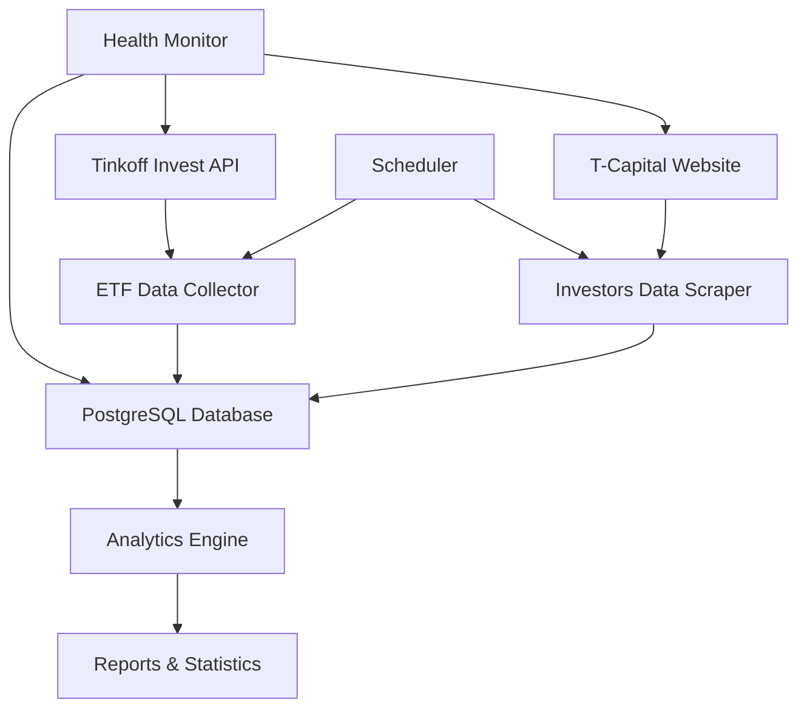

# ETF Monitor - Обзор системы

## 🎯 Назначение

ETF Monitor - это комплексная система мониторинга ETF фондов Т-Капитал, которая автоматически собирает, анализирует и архивирует данные о биржевых фондах и их инвесторах.

## 🏗️ Архитектура системы



## 📊 Источники данных

### 1. Tinkoff Invest API
- **Данные**: Паспорт фонда, комиссии, технические параметры
- **Частота**: Каждые 5 минут (настраивается)
- **Лимиты**: 60 запросов в минуту
- **Формат**: JSON через gRPC

### 2. Сайт T-Capital
- **Данные**: Количество инвесторов, состав фонда (топ-10)
- **Частота**: Каждые 30 минут (настраивается)
- **Метод**: Веб-скрейпинг с Puppeteer
- **Источник**: https://t-capital-funds.ru

## 🗄️ Структура данных

### Таблица `etf_snapshot`
```sql
CREATE TABLE etf_snapshot (
    id SERIAL PRIMARY KEY,
    figi VARCHAR(12) NOT NULL,           -- FIGI идентификатор
    data JSONB NOT NULL,                 -- Полные данные ETF
    captured_at TIMESTAMP WITH TIME ZONE,-- Время снимка
    UNIQUE(figi, captured_at)
);
```

### Таблица `investors_snapshot`
```sql
CREATE TABLE investors_snapshot (
    id SERIAL PRIMARY KEY,
    figi VARCHAR(12) NOT NULL,           -- FIGI идентификатор
    investors INTEGER NOT NULL,          -- Количество инвесторов
    captured_at TIMESTAMP WITH TIME ZONE,-- Время снимка
    UNIQUE(figi, captured_at)
);
```

## 🔧 Компоненты системы

### Сервисы (`src/services/`)
- **`tinkoff-api.js`** - Работа с Tinkoff Invest API
- **`scraper.js`** - Веб-скрейпинг сайта T-Capital

### Скрипты (`src/scripts/`)
- **`fetch-api.js`** - Сбор данных ETF через API
- **`fetch-investors.js`** - Сбор данных об инвесторах
- **`analytics-report.js`** - Генерация аналитических отчетов

### Утилиты (`src/utils/`)
- **`logger.js`** - Система логирования
- **`analytics.js`** - Аналитические функции
- **`health-check.js`** - Мониторинг состояния системы

### База данных (`src/database/`)
- **`client.js`** - Клиент PostgreSQL
- **`schema.sql`** - SQL схема
- **`setup.js`** - Инициализация БД

## 📈 Аналитические возможности

### Базовая статистика
- Общее количество ETF фондов
- Количество инвесторов по фондам
- Распределение по валютам
- Динамика роста/убыли инвесторов

### Отчеты
- **Полный отчет** - общая статистика системы
- **Отчет по ETF** - детальная информация по конкретному фонду
- **Топ фондов** - рейтинги по различным критериям
- **Трендовый анализ** - быстрорастущие фонды

### Примеры метрик
```javascript
// Топ-10 ETF по количеству инвесторов
await analytics.getTopEtfsByInvestors(10);

// Рост инвесторов за последние 30 дней
await analytics.getInvestorsGrowth('BBG004730N88', 30);

// Быстрорастущие ETF за неделю
await analytics.getFastestGrowingEtfs(7, 10);
```

## ⚙️ Конфигурация

### Переменные окружения
```env
TINKOFF_TOKEN=your_token                # API токен
DATABASE_URL=postgres://...             # Подключение к БД
ETF_FETCH_INTERVAL=5                    # Интервал сбора ETF (мин)
INVESTORS_FETCH_INTERVAL=30             # Интервал сбора инвесторов (мин)
PUPPETEER_HEADLESS=true                 # Режим браузера
LOG_LEVEL=info                          # Уровень логирования
```

### Планировщик задач
- **ETF данные**: каждые 5 минут (по умолчанию)
- **Данные инвесторов**: каждые 30 минут (по умолчанию)
- **Проверка здоровья**: каждые 15 минут (опционально)
- **Резервное копирование**: ежедневно в 2:00 (опционально)

## 🚀 Развертывание

### Локальная разработка
```bash
npm install
npm run setup-db
npm start
```

### Docker
```bash
echo "TINKOFF_TOKEN=your_token" > .env
docker-compose up -d
```

### Продакшен
См. подробное руководство в [DEPLOYMENT.md](DEPLOYMENT.md)

## 📊 Мониторинг

### Проверка состояния
```bash
npm run health-check      # Полная проверка
npm run health-quick      # Быстрая проверка
```

### Метрики системы
- Доступность API и сайта
- Актуальность данных
- Объем собранных данных
- Производительность запросов

### Алерты
- Недоступность источников данных
- Устаревшие данные (>1 час для ETF, >2 часов для инвесторов)
- Ошибки сбора данных
- Проблемы с базой данных

## 📋 Команды управления

### Сбор данных
```bash
npm run fetch-etfs        # Сбор данных ETF
npm run fetch-investors   # Сбор данных инвесторов
```

### Статистика
```bash
npm run stats-etfs        # Статистика ETF
npm run stats-investors   # Статистика инвесторов
```

### Отчеты
```bash
npm run report-full       # Полный отчет
npm run report-etf FIGI   # Отчет по ETF
```

### Система
```bash
npm run setup-db          # Настройка БД
npm run health-check      # Проверка здоровья
```

## 🔍 Примеры использования

### Получение топ-10 ETF
```javascript
import { analytics } from './src/utils/analytics.js';
const topEtfs = await analytics.getTopEtfsByInvestors(10);
```

### Анализ роста инвестора
```javascript
const growth = await analytics.getInvestorsGrowth('BBG004730N88', 30);
```

### SQL запросы
```sql
-- Последние данные по всем ETF
SELECT DISTINCT ON (figi) figi, data->>'name', captured_at
FROM etf_snapshot ORDER BY figi, captured_at DESC;

-- Динамика инвесторов
SELECT figi, investors, captured_at,
       LAG(investors) OVER (PARTITION BY figi ORDER BY captured_at) as prev
FROM investors_snapshot ORDER BY captured_at DESC;
```

## 🛠️ Расширение функциональности

### Добавление новых источников данных
1. Создать новый сервис в `src/services/`
2. Добавить скрипт сбора в `src/scripts/`
3. Обновить схему БД при необходимости
4. Добавить в планировщик

### Новые аналитические метрики
1. Добавить методы в `src/utils/analytics.js`
2. Создать соответствующие SQL запросы
3. Обновить отчеты в `src/scripts/analytics-report.js`

### Интеграция с внешними системами
- REST API для доступа к данным
- Webhook уведомления
- Экспорт в различные форматы
- Интеграция с BI системами

## 📚 Документация

- **[README.md](README.md)** - Основная документация
- **[EXAMPLES.md](EXAMPLES.md)** - Примеры использования
- **[DEPLOYMENT.md](DEPLOYMENT.md)** - Руководство по развертыванию
- **Исходный код** - Подробные комментарии в коде

## 🔒 Безопасность

- Токен API хранится в переменных окружения
- Подключение к БД через защищенное соединение
- Минимальные права доступа для пользователей
- Регулярные обновления зависимостей
- Мониторинг безопасности

## 📈 Производительность

- Пакетная обработка данных
- Соблюдение rate limits API
- Оптимизированные SQL запросы
- Индексы для быстрого поиска
- Кэширование часто используемых данных

---

**ETF Monitor** предоставляет полную картину рынка ETF фондов Т-Капитал, позволяя принимать обоснованные инвестиционные решения на основе актуальных данных и исторической аналитики.
